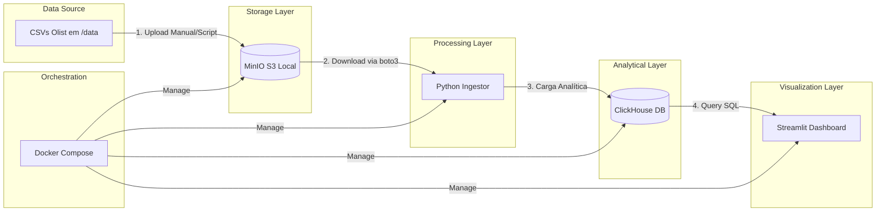

# System Design — Olist SRE Pipeline (Local Architecture)

Este documento detalha o design do sistema para a fase local (Aula 04), focando em uma arquitetura 100% containerizada e resiliente para o processamento de dados da Olist.

## 1. Descrição da Arquitetura Local
A arquitetura é baseada em microserviços locais orquestrados via **Docker Compose**. Os dados brutos (CSVs) são armazenados em um **MinIO** (Object Storage compatível com S3). Um **Ingestor Python** monitora o MinIO, processa os arquivos e carrega-os no **ClickHouse**, um banco de dados analítico de alta performance orientado a colunas. A visualização é feita via **Streamlit**. Toda a infraestrutura é monitorada por um loop de SRE que garante a saúde e a integridade do pipeline.

## 2. Diagrama da Arquitetura (Mermaid)

## 3. Detalhamento dos Fluxos de Dados (Arestas)

1.  **CSV -> MinIO:** Os arquivos de pedidos, produtos e clientes da Olist localizados em `src/data/` são enviados para um bucket no MinIO. Isso simula o comportamento de um S3 real, garantindo portabilidade para cloud futuramente.
2.  **MinIO -> Ingestor:** O script Python utiliza a biblioteca `boto3` para listar e baixar os arquivos brutos. O processamento ocorre em memória (ou chunks) para validação inicial.
3.  **Ingestor -> ClickHouse:** Os dados validados são inseridos no ClickHouse. O ClickHouse é escolhido pela sua eficiência em agregações e compressão de dados, atendendo requisitos de performance.
4.  **ClickHouse -> Streamlit:** O dashboard Streamlit executa queries SQL diretamente no ClickHouse para gerar visualizações de KPIs de negócio e métricas de saúde do pipeline.

## 4. Componentes e Requisitos (RF/RNF)

| Componente | Função | RFs Atendidos | RNFs Atendidos |
| :--- | :--- | :--- | :--- |
| **MinIO** | Object Storage (S3 API) | RF-01 (Ingestão) | RNF-01 (Integridade), RNF-10 (Portabilidade) |
| **Python Ingestor** | ETL Engine (Boto3/Pandas) | RF-01, RF-02, RF-04, RF-06 | RNF-02 (Performance), RNF-09 (Modularidade) |
| **ClickHouse** | Banco Analítico | RF-03 (Transformação), RF-04 | RNF-01 (Integridade), RNF-02 (Performance) |
| **Streamlit** | Dashboard | RF-05 (Visualização), RF-07 | RNF-03 (Latência), RNF-05 (Clareza Visual) |
| **Docker Compose** | Orquestração Local | RF-08 (Resiliência) | RNF-10 (Portabilidade), RNF-07 (MTTR) |

## 5. Closed Loop SRE (Mínimo)

Para garantir que o sistema seja confiável e transparente, implementamos os seguintes controles:

-   **Healthchecks:** Todos os containers no Docker Compose possuem `healthcheck` definidos. O Ingestor só inicia após o MinIO e o ClickHouse estarem `healthy`.
-   **Logs Centralizados:** O Ingestor Python emite logs estruturados (JSON) capturando:
    -   Início/Fim de cada arquivo.
    -   Contagem de linhas lidas vs. inseridas (RNF-01).
    -   Erros de parsing (RF-06).
-   **Validação de Ingestão:** Ao final de cada carga, o Ingestor executa uma query de contagem no ClickHouse e compara com o metadata do arquivo no MinIO. Se houver divergência, um alerta é exibido no dashboard.
-   **Dashboard de Saúde:** Uma aba dedicada no Streamlit mostra:
    -   Status dos serviços (Up/Down).
    -   Tempo da última carga (Latência).
    -   Total de registros processados nas últimas 24h.
    -   Alertas de arquivos corrompidos.

## 6. Premissas de Localidade
- Não há dependência de recursos AWS (IAM, S3, RDS).
- Toda a autenticação é baseada em variáveis de ambiente (`.env`) locais.
- O volume de 100k registros deve ser processado em hardware local padrão (ex: 8GB RAM, 4 vCPUs).
